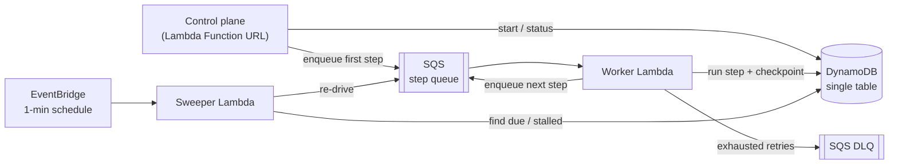
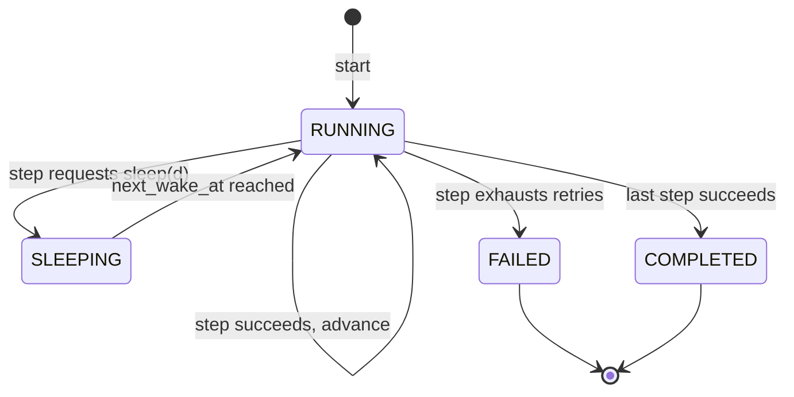

# Loom - a minimal durable workflow engine

> A small, self-hosted durable execution engine built on AWS serverless primitives.
> Define a workflow as a sequence of idempotent steps; Loom runs it to completion
> across crashes, retries, and multi-hour sleeps - without losing progress.


---

## What this is

Loom is a stripped-down [Temporal](https://temporal.io)/[Step Functions](https://aws.amazon.com/step-functions/) - the *mechanism*, not the product. You register a workflow as an ordered list of steps. Loom drives each execution forward one step at a time, **checkpointing state after every step** so that if a worker dies mid-flight, another invocation resumes from the last committed step rather than starting over.

The point of the project is the **correctness reasoning**, not the feature count. Every interesting decision here is a distributed-systems tradeoff: how to get exactly-once-*ish* progress out of at-least-once delivery, how to recover an execution whose driver crashed, how to implement a durable `sleep(2 hours)` on a platform where nothing runs for 2 hours.

## What this is *not*

Loom is **checkpoint-based, not replay-based.** Temporal achieves durability by event-sourcing your workflow code and deterministically replaying it on resume. Loom does something simpler and more honest: it persists explicit state at each step boundary and only the step boundaries are durable. The upshot:

- Steps are plain functions. They do **not** need to be deterministic.
- There is no magic re-execution of arbitrary code between steps - only checkpointed step transitions.
- The cost: you can't write free-form imperative control flow and have it survive a crash. Durability lives at the seams between steps, by design.

This is the right model for a learning project: it surfaces all the same failure modes as a real engine, without the determinism machinery obscuring them.

---

## Architecture



Three Lambdas, one table, two queues, one schedule. No API Gateway, no S3, no ElastiCache.

| Component | AWS primitive | Role |
|---|---|---|
| **Control plane** | Lambda Function URL | Start executions, query status/history over HTTP |
| **Worker** | Lambda (SQS-triggered) | Run the current step, checkpoint, advance state, enqueue next |
| **Sweeper** | Lambda (EventBridge-triggered) | Wake due timers; re-drive stalled executions |
| **State store** | DynamoDB (single table, **provisioned**) | Execution + step-history items, optimistic concurrency |
| **Step queue** | SQS | Progression messages; visibility timeout = free retry |
| **Failure sink** | SQS DLQ | Poison messages after max receives |
| **Clock** | EventBridge scheduled rule | 1-minute tick driving the sweeper |

### Why SQS *and* EventBridge?

SQS drives the **happy path**: finishing step N enqueues step N+1, so progression is immediate and event-driven. But SQS alone can't do two things - (1) sleeps/backoff longer than its 15-minute `DelaySeconds` ceiling, and (2) recovery when a progression message is never enqueued (worker crashed *after* committing state but *before* enqueuing the next step). The EventBridge tick + sweeper is the belt to SQS's braces: it periodically scans for executions whose `next_wake_at` has passed and re-drives them. Happy path is fast; recovery is guaranteed.

---

## Execution model

An execution moves through this lifecycle:



Each advance is guarded by **optimistic concurrency**. The execution item carries a `version` attribute; every transition is a DynamoDB conditional write of the form *"advance from step N (version V) only if current_step is still N and version is still V."* If two workers process a duplicated message, exactly one conditional write wins; the loser's write fails the condition and it no-ops. This is how at-least-once delivery becomes at-most-once *state advancement*.

> **The honest caveat:** Loom guarantees idempotent **state transitions**, but a step that performs an external side effect can still run more than once (worker dies after the side effect, before the checkpoint). True exactly-once side effects require the *step itself* to be idempotent. Loom helps by handing each step a stable `idempotency_key` (`{execution_id}:{step_index}`) to pass downstream. This boundary is documented, not hidden - it's the same boundary every real engine has.

---

## Data model (single table)

One DynamoDB table, provisioned 25 WCU / 25 RCU to stay always-free.

| Item | PK | SK | Key attributes |
|---|---|---|---|
| **Execution** | `EXEC#<id>` | `#META` | `workflow`, `status`, `current_step`, `version`, `context` (accumulated step outputs), `next_wake_at`, `created_at`, `updated_at` |
| **Step history** | `EXEC#<id>` | `STEP#<nnn>#<name>` | `status`, `attempts`, `result`, `error`, `started_at`, `finished_at` |

**Due-work index (GSI1):** `GSI1PK = DUE#<shard>`, `GSI1SK = next_wake_at`. The sweeper queries each shard for items with `next_wake_at <= now`. Sharding (`shard = hash(id) % N`) keeps the index off a single hot partition once volume grows - at toy scale `N=1` is fine, but the schema is built so the decision is already made, not deferred.

Step-history items give you a free audit log: the full attempt-by-attempt record of every execution, queryable by a single partition read.

---

## Correctness & failure modes

This table *is* the project. Each row is a failure the engine must survive.

| Failure | What goes wrong | How Loom handles it |
|---|---|---|
| **Duplicate delivery** | SQS is at-least-once; the same step message arrives twice | Conditional-write advance keyed on `(current_step, version)`; the second delivery fails the condition and no-ops |
| **Crash mid-step** | Worker dies after the side effect, before the checkpoint | Step re-runs on redelivery; correctness depends on the step being idempotent via its `idempotency_key`. Documented boundary. |
| **Crash after checkpoint, before enqueue** | State advanced but the next-step message was never sent -> execution stalls | Sweeper finds it (`status=RUNNING`, `next_wake_at` past) and re-drives it |
| **Visibility timeout too short** | Step still running when SQS redelivers -> concurrent double-run | Visibility timeout set well above the step timeout budget; documented invariant |
| **Poison step** | A step fails every attempt | Per-step `max_attempts`, then transition to `FAILED` + message lands in DLQ |
| **Concurrent sweep + happy-path** | Sweeper and an in-flight message both drive the same execution | Same optimistic-lock guard; one wins, one no-ops |
| **Lost timer** | A `sleep` should resume but the message vanished | Sleeps don't rely on SQS delay alone; `next_wake_at` in DynamoDB + sweeper is the source of truth |

---

## Durable timers & retries

**Backoff** is per-step policy: `{max_attempts, base, max_delay}`, exponential. On failure the worker records the attempt, sets `next_wake_at = now + delay`, and either re-enqueues with `DelaySeconds` (delays ≤ 15 min) or leaves the sweeper to pick it up (delays > 15 min).

**Sleep** (`sleep(duration)`) is just the same mechanism with a long delay: set `status=SLEEPING`, `next_wake_at = now + duration`, persist, and stop. No compute runs during the sleep - the sweeper resumes the execution when the clock catches up. A multi-hour sleep costs nothing because nothing is running.

The 15-minute SQS `DelaySeconds` ceiling is *why* the sweeper exists for long waits - a real constraint driving a real design decision, which is exactly the kind of reasoning this project is meant to preserve.

---

## Defining a workflow

Workflows are declared in code via a small registry. (Illustrative - the engine internals are the actual build.)

```python
@workflow("order_fulfillment")
class OrderFulfillment:
    steps = [
        reserve_inventory,   # each step: (ctx) -> dict, merged into ctx
        charge_payment,      # idempotency_key supplied by the engine
        sleep(hours=1),      # durable wait, zero compute
        ship_order,
        notify_customer,
    ]
    retry = RetryPolicy(max_attempts=5, base=2, max_delay=900)
```

A step receives the accumulated `context` and returns a result that's checkpointed and merged in. That's the whole contract.

---

## Cost model

Designed to sit inside AWS **always-free** allowances (not the 12-month trial tier), so it costs nothing to leave running indefinitely.

| Service | Allowance used | Notes |
|---|---|---|
| Lambda | Always-free 1M req + 400k GB-s / month | 3 functions, low volume |
| DynamoDB | Always-free 25 WCU / 25 RCU / 25 GB | **Provisioned** mode - on-demand is not the always-free path |
| SQS | Always-free 1M req / month | Queue + DLQ |
| EventBridge | Scheduled rule (1-min tick) | Free at this scale |

**Traps deliberately avoided:** API Gateway (billed per request - replaced by a **Lambda Function URL**) and S3 (no object storage needed). Verify current free-tier limits against AWS docs before relying on them; allowances change.

---

## Tech stack

- **Python 3.12** - engine + handlers
- **AWS CDK (Python)** - all infrastructure as code, hand-written
- **DynamoDB / SQS / Lambda / EventBridge** - runtime
- **Lambda Function URL** (+ optional FastAPI via Mangum) - control plane
- **GitHub Actions** - CI/CD
- No third-party orchestration libraries - the engine is the point

## Project layout

```
loom/
├── infra/            # CDK app - table, queues, functions, schedule
├── engine/           # core: registry, state machine, transitions, retries
├── handlers/         # worker, sweeper, control-plane entrypoints
├── workflows/        # example workflow definitions
├── tests/            # unit + integration (failure-injection)
└── DESIGN.md         # design doc - failure modes decided before code
```

## Roadmap

Build order tracks the four opening issues, each a vertical slice:

1. **#1** - State model, single-table schema, CDK skeleton
2. **#2** - Worker + SQS-driven progression + idempotent transitions
3. **#3** - Retries/backoff + durable timers + recovery sweeper
4. **#4** - Control plane (Function URL) + observability

*Future:* compensation / saga rollback on failure, parallel (fan-out/fan-in) steps, signals/external events, a minimal status UI.

## License

MIT - public repo.
